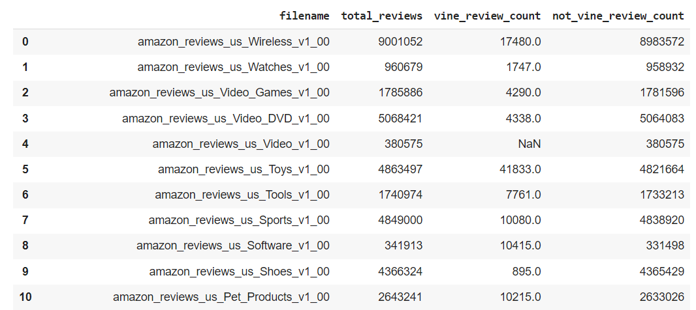
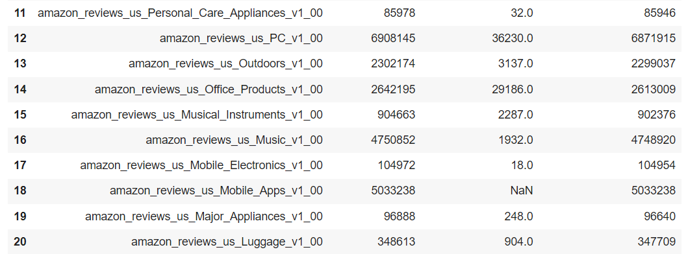
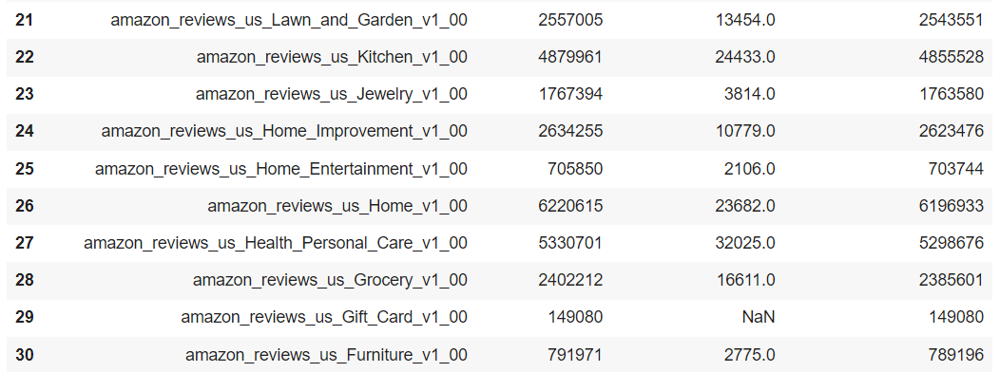
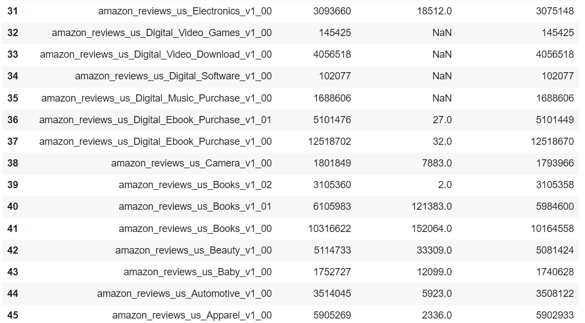

# google-colab-etl-amazon-reviews

Author:  Erin James Wills - ejw.data@gmail.com    

  
<cite>Photo by [Mika Baumeister](https://unsplash.com/@mbaumi?utm_source=unsplash&utm_medium=referral&utm_content=creditCopyText) on [Unsplash](https://unsplash.com/s/photos/big-data?utm_source=unsplash&utm_medium=referral&utm_content=creditCopyText)</cite>

 

## Overview 

Using Spark and Amazon RDS to clean and summarize amazon reviews to determine usefulness of product feedback.  

This repository does the following:
*  Performs an ETL process and loads data to an AWS Postgres database.  Detailed instructions are found in the `amazon_ETL.ipynb` notebook.  
*  Shows how to query the database
*  Extracts data from the 30+ Amazon datasets make a table of all the data.  This process may take up to 4.5 hours.  
*  Analyzes the vine reviewer difference compared to other reviewers.  

 

## Results  

Looking only at the Health and Personal Product dataset, it appears that Vine reviewer star ratings are no different than other members.  The only significant difference is the effect of splitting the data based on the product purchase verfication status.  This is a small sample size so this result is not being considered significant.  

 

## Future Work

More analysis will be performed within the `amazon_advance_anlaysis.ipynb`.  Instead of looking at the macro scale results; I am curious if I can find several groupings of data that may make up similar reviewers or determine if I can standardize the data such that one users ratings are standardized to be more like other members rankings.  

 

## Technologies    
*  Google Colaboratory
*  pySpark
*  Amazon RDS

 

## Methods
*  indendent t-test
*  Wilcoxon Rank test
*  Histograms

 

## Data Source  
All datasets can be found at https://s3.amazonaws.com/amazon-reviews-pds/tsv/index.txt

 

## ETL Setup and Installation  
1. Clone the repo to your local machine
1. Load `amazon_ETL` to Google Colaboratory
1. Login to Amazon Console and create an AWS RDS PostgreSQL.  
    *  Make the database public
    *  Name the database `amazon_rds`
    *  Record the db endpoint, username and password.  
1.  Make sure the database is running and if not, start the database.
1.  Add the recorded information to `config.py`
1.  Open pgAdman and create a server connection.  Use the recorded information to create the database connection.  
1.  Open a query tool and run the `schema.sql` file to create the database tables.  
1.  Verify that the tables were created in pgAdmin.  
1. Run the notebook `amazon_ETL` in Google Colab.  Select the `config.py` file when prompted to load a file.  
1.  No other changes are probably needed and should take less than 30 minutes to run.  

## Analysis
1.  In the cloned repo is also several files used to analyze the data.  
1.  The `amazon_vine_users` is a notebook that extracts review data from all the amazon datasets.  This notebook includes information about the total reviews, the number of vine reviews, and the vine reviewers.  
1.  The `amazon_query` notebook shows how to connect to the database and perform queries.  
1.  The `amazon_vine_program_analysis` does a simple analysis of whether vine members review content different than non-vine members.  
1.  Additional analysis is being performed in the `amazon_advance_analysis` notebook.  This is ongoing work where I look at specific reviewer behavior.  

**Note:** Remember to shutdown and delete any services so not to incur any service fees.  

 

## Images  

Example of the review types for all datasets:

