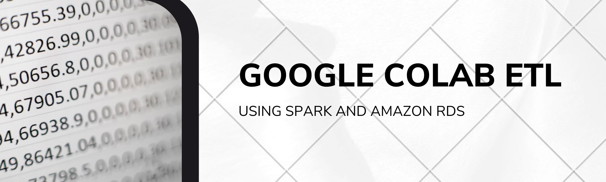

# google-colab-etl-amazon-reviews

Author:  Erin James Wills - ejw.data@gmail.com    

  
<cite>Photo by [Mika Baumeister](https://unsplash.com/@mbaumi?utm_source=unsplash&utm_medium=referral&utm_content=creditCopyText) on [Unsplash](https://unsplash.com/s/photos/big-data?utm_source=unsplash&utm_medium=referral&utm_content=creditCopyText)</cite>

 

## Overview 

Using Spark and Amazon RDS to clean and summarize amazon reviews to determine usefulness of product feedback  

 

## Technologies    
*  Google Colaboratory
*  pySpark
*  Amazon RDS

 

## Data Source  
All datasets can be found at https://s3.amazonaws.com/amazon-reviews-pds/tsv/index.txt

 

## Setup and Installation  
1. Clone the repo to your local machine
1. Load `amazon_reviews` to Google Colaboratory
1. Login to Amazon Console and create an AWS RDS PostgreSQL.  
    *  Make the database public
    *  Name the database `amazon_rds`
    *  Record the db endpoint, username and password.  
1.  Make sure the database is running and if not, start the database.
1.  Add the recorded information to `config.py`
1.  Open pgAdman and create a server connection.  Use the recorded information to create the database connection.  
1.  Open a query tool and run the schema.sql file to create the database tables.  
1.  Verify that the tables were created in pgAdmin.  
1. Run the notebook in Google Colab.  Select the `config.py` file when prompted to load a file.  
1.  No other changes are probably needed and should take less than 30 minutes to run.  

**Note:** Remember to shutdown and delete any services so not to incur any service fees.  

